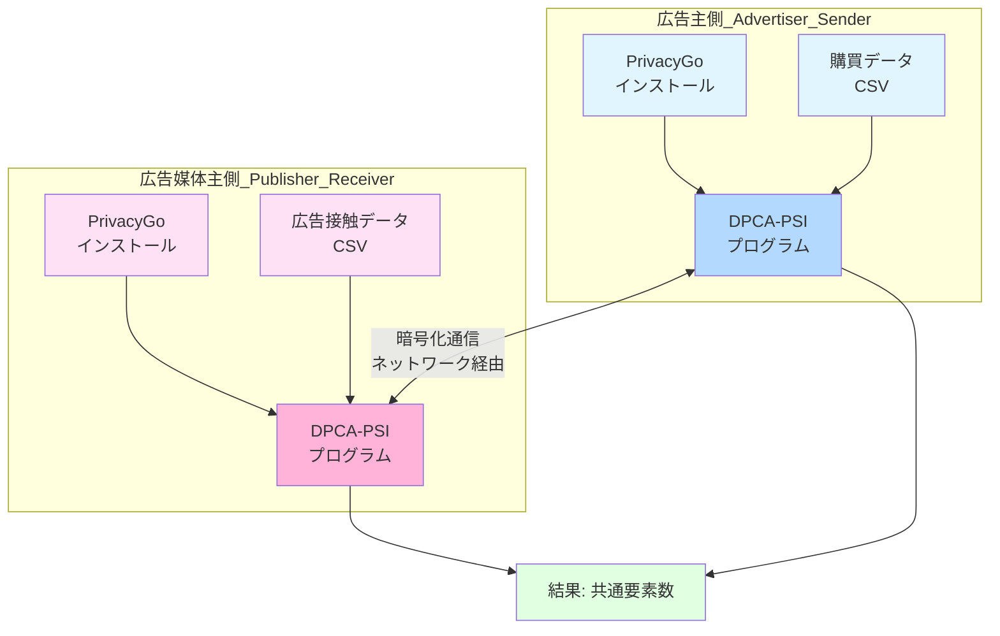
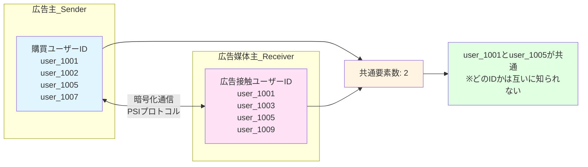
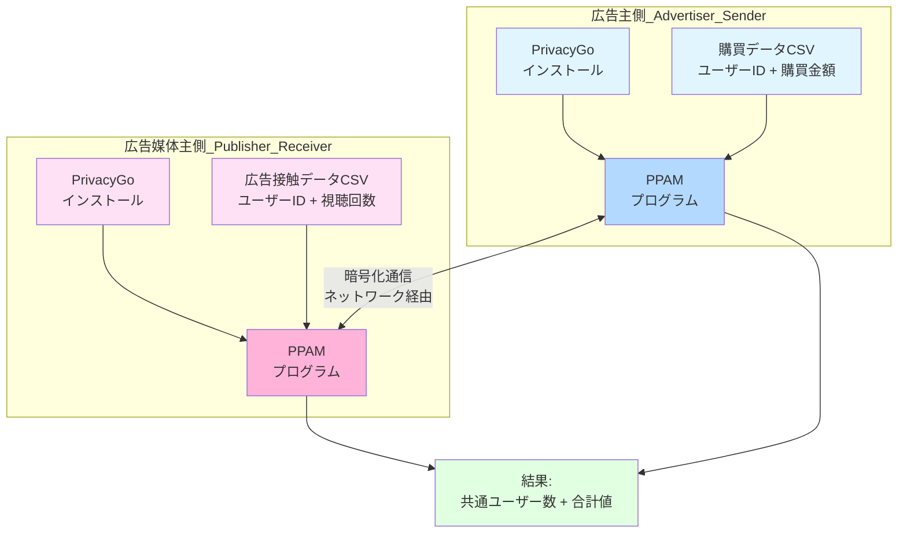
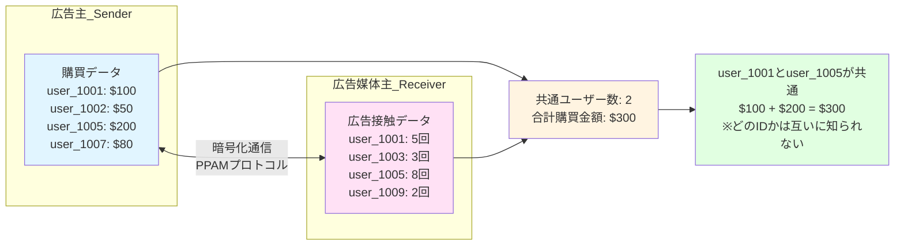

# PrivacyGo-with-build-script

このリポジトリは PrivacyGo のフォークであり、ビルド手順を簡略化するためのシェルスクリプト（build.sh）を追加・整備しています。元のリポジトリに比べて、依存ライブラリのビルドやセットアップを自動化し、より簡単に環境構築できることが特徴です。

- 元の README はこちら: [README_upstream.md](./README_upstream.md)

## 動作確認環境

- Windows 11 + WSL2 (Ubuntu 24.04)

## 変更点について

本リポジトリでは、元のリポジトリから一部ソースファイル（例: `csv_file_o.h` など）に `#include` の追加等の修正を行っています。

これらはビルド時にエラーが発生したため修正したものです。エラーが出た理由としては「必要なヘッダファイルがインクルードされておらず、型や関数が未定義となった」から「該当するヘッダファイルを明示的にインクルードする」ことで対応しています。

## ビルド方法

リポジトリのルートディレクトリで以下のコマンドを実行してください。

```bash
./build.sh
```

## DPCA-PSI（Differentially Private Cardinality Approximation - Private Set Intersection）について

### DPCA-PSI とは

DPCA-PSI は、2 つの組織（例：広告主と広告媒体主）がそれぞれ保有するデータセットの**共通要素数（カーディナリティ）のみ**を、プライバシーを保護しながら安全に計算するための技術です。

**重要な特徴：**

- 相手に自分のデータの中身（個別のユーザー ID など）を一切開示しません
- 計算結果として得られるのは「共通要素数」のみで、「どの ID が共通か」は分かりません
- 差分プライバシー技術により、さらに個人情報漏洩リスクを低減しています

### 広告主と広告媒体主の実用例

#### シナリオ

- **広告主（Advertiser）**: 購買データ（購入したユーザーの ID リスト）を保有
- **広告媒体主（Publisher/Platform）**: 広告接触データ（広告を見たユーザーの ID リスト）を保有
- **知りたいこと**: 「広告を見て実際に購買した人は何人か？」（コンバージョン数）

#### システム構成図



**重要：** 広告主と広告媒体主の**両方**が、それぞれの環境に PrivacyGo をインストールし、DPCA-PSI プログラムを実行する必要があります。

#### データの流れ



#### 処理の流れ

1. **事前準備（両組織で実施）**

   - **広告主・広告媒体主ともに**：このリポジトリ（PrivacyGo）をクローンし、`./build.sh` でビルド
   - 広告主：購買ユーザー ID のリストを CSV ファイルとして準備
   - 広告媒体主：広告接触ユーザー ID のリストを CSV ファイルとして準備

2. **ネットワーク接続設定**

   - 両者は事前に通信する IP アドレスとポート番号を決定
   - 設定ファイル（JSON）に記載

3. **プログラム実行**

   - 両者がそれぞれのマシンで DPCA-PSI プログラムを起動
   - 暗号化された通信で互いにデータをやり取り
   - PSI プロトコルに基づいて共通要素数を計算

4. **結果取得**

   - 両者（または片方）が「共通要素数」を取得
   - 例：「広告接触者のうち、購買に至ったユーザーは 2 名」

5. **プライバシー保護**
   - 広告主は広告媒体主の ID リストを知ることができない
   - 広告媒体主は広告主の購買者 ID を知ることができない
   - どちらも「どの ID が共通か」は分からない

### 環境構築と実行方法

#### 1. 環境のセットアップ

このリポジトリをビルドすることで、DPCA-PSI 実行環境が整います。

```bash
# リポジトリのルートで実行
./build.sh
```

#### 2. データファイルの準備

それぞれの組織が自分のユーザー ID リストを CSV 形式で準備します。

例：`advertiser_users.csv`（広告主側）

```csv
user_1001
user_1002
user_1005
user_1007
```

例：`platform_users.csv`（広告媒体主側）

```csv
user_1001
user_1003
user_1005
user_1009
```

#### 3. 設定ファイルの編集

`dpca-psi/example/json/` ディレクトリ内の設定ファイルを編集し、接続先 IP アドレス、ポート番号、入力ファイルパスなどを指定します。

#### 4. プログラムの実行

**広告主側（Sender）:**

```bash
cd ./dpca-psi/build/example/scripts && bash sender_test.sh
```

**広告媒体主側（Receiver）:**

```bash
cd ./dpca-psi/build/example/scripts && bash receiver_test.sh
```

※それぞれ別のマシン（または別のターミナル）で実行します。

#### 5. 結果の確認

実行後、以下のような出力が得られます：

```
[DPCA-PSI] Total Communication is 15.2 MB.
[DPCA-PSI] Total time is 1.85 s.
[DPCA-PSI] Intersection size: 2
```

この例では、共通するユーザーが 2 名いることが分かります。

### よくある質問

**Q: どのユーザー ID が共通していたか分かりますか？**  
A: いいえ、DPCA-PSI では共通要素の「件数」のみが分かり、「どの ID が共通か」は分かりません。これがプライバシー保護の核心部分です。

**Q: 共通ユーザー数以外の情報も得られますか？**  
A: DPCA-PSI では共通ユーザー数（カーディナリティ）のみが得られます。ただし、このリポジトリに含まれる**PPAM（Privacy-Preserving Audience Measurement）**を使用すれば、共通ユーザー数に加えて、共通ユーザーの**合計値（例：合計視聴回数、合計購買金額など）**も計算できます。詳しくは下記の PPAM セクションをご覧ください。

**Q: どの ID が共通かを知る方法はありますか？**  
A: DPCA-PSI や PPAM では、プライバシー保護のため「どの ID が共通か」は分かりません。もし共通 ID のリストが必要な場合は、別の PSI プロトコル（例：ECDH-PSI）を使用する必要がありますが、プライバシーリスクが高まります。

**Q: 実運用で使うにはどうすればよいですか？**  
A: 両組織がそれぞれ独立したサーバーでプログラムを実行し、安全なネットワーク経由で通信します。設定ファイルで接続先や入力データを指定します。

**Q: データサイズの制限はありますか？**  
A: 数百万件規模の ID リストでも処理可能ですが、データ量が多いほど通信量と処理時間が増加します。

### サンプルプログラム実行方法（デモ用）

サンプルプログラムは、同一マシン上で送信側と受信側をシミュレートします。

1. 1 つ目のターミナルで以下を実行（送信側）

```bash
cd ./dpca-psi/build/example/scripts && bash sender_test.sh
```

2. 2 つ目のターミナルで以下を実行（受信側）

```bash
cd ./dpca-psi/build/example/scripts && bash receiver_test.sh
```

## PPAM（Privacy-Preserving Audience Measurement）について

### PPAM とは

PPAM は、2 つの組織がそれぞれ保有するデータセットの**共通要素数**に加えて、**共通要素の合計値**をプライバシーを保護しながら安全に計算するための技術です。

**DPCA-PSI との違い：**

| 項目                   | DPCA-PSI             | PPAM             |
| ---------------------- | -------------------- | ---------------- |
| 共通要素数             | ✓ 計算可能           | ✓ 計算可能       |
| 合計値（視聴回数など） | ✗ 不可               | ✓ 計算可能       |
| 用途                   | シンプルな件数の突合 | 複雑な集計・測定 |

**重要な特徴：**

- 相手に自分のデータの中身（個別のユーザー ID や視聴データ）を一切開示しません
- 共通ユーザーの「件数」と「合計値」が得られますが、「どの ID が共通か」は分かりません
- 暗号化技術により、プライバシーを保ったまま集計が可能です

### 広告主と広告媒体主の実用例

#### シナリオ

- **広告主（Advertiser）**: 購買データ（購入したユーザー ID と購買金額）を保有
- **広告媒体主（Publisher/Platform）**: 広告接触データ（広告を見たユーザー ID と視聴回数）を保有
- **知りたいこと**:
  - 「広告を見て実際に購買した人は何人か？」（共通ユーザー数）
  - 「その人たちの合計購買金額はいくらか？」（合計値）

#### システム構成図



**重要：** 広告主と広告媒体主の**両方**が、それぞれの環境に PrivacyGo をインストールし、PPAM プログラムを実行する必要があります。

#### データの流れと計算例



この例では：

- 共通ユーザー：`user_1001` と `user_1005` の 2 名
- 合計購買金額：$100 + $200 = $300
- どの ID が共通かは両者に知られない

### 環境構築と実行方法

#### 1. 環境のセットアップ

このリポジトリをビルドすることで、PPAM 実行環境が整います。

```bash
# リポジトリのルートで実行
./build.sh
```

#### 2. データファイルの準備

それぞれの組織が自分のデータを CSV 形式で準備します。CSV の各行には、ユーザー ID、その他の識別子、数値データ（集計対象）を含めます。

例：`advertiser_purchase.csv`（広告主側 - 購買データ）

```csv
user_1001,advertiser_id_1,advertiser_id_2,100
user_1002,advertiser_id_3,advertiser_id_4,50
user_1005,advertiser_id_5,advertiser_id_6,200
user_1007,advertiser_id_7,advertiser_id_8,80
```

例：`platform_views.csv`（広告媒体主側 - 広告接触データ）

```csv
user_1001,platform_id_1,platform_id_2,5
user_1003,platform_id_3,platform_id_4,3
user_1005,platform_id_5,platform_id_6,8
user_1009,platform_id_7,platform_id_8,2
```

**CSV フォーマット説明：**

- 各行の最後の列（例：100, 50, 200...）が集計対象の数値データ
- 前の列はユーザー識別子（複数の ID で同一ユーザーを照合可能）
- 共通する ID があるユーザーについて、数値データの合計を計算

#### 3. 設定ファイルの編集

`ppam/example/json/` ディレクトリ内の設定ファイルを編集し、接続先 IP アドレス、ポート番号、入力ファイルパスなどを指定します。

#### 4. プログラムの実行

**広告主側（Sender）:**

```bash
cd ./ppam/build/example/scripts && bash sender_test.sh
```

**広告媒体主側（Receiver）:**

```bash
cd ./ppam/build/example/scripts && bash receiver_test.sh
```

※それぞれ別のマシン（または別のターミナル）で実行します。

#### 5. 結果の確認

実行後、以下のような出力が得られます：

```
I0920 22:10:46.263578 207638 ppam_example.cpp:190] Receiver
I0920 22:10:46.263633 207638 ppam_example.cpp:191] Apply dp: false
I0920 22:10:46.263674 207638 ppam_example.cpp:192] Total Communication is 16.8218(0.171878 + 16.65)MB.
I0920 22:10:46.263761 207638 ppam_example.cpp:194] Total time is 2.12235 s.
I0920 22:10:46.263799 207638 ppam_example.cpp:195] Expected / Actual sum is 42.0783 / 42.0783
```

**出力結果の説明：**

- `Receiver`: 受信側（広告媒体主側）の出力
- `Apply dp: false`: 差分プライバシーを適用していない（false = 無効）
- `Total Communication is 16.8218MB`: 通信データ量は約 16.82MB
- `Total time is 2.12235 s`: 処理時間は約 2.12 秒
- `Expected / Actual sum is 42.0783 / 42.0783`:
  - **推定合計値**と**実測合計値**が一致していることを示す
  - この例では、共通ユーザーの数値データ合計が**42.0783**であることが分かる
  - これが「共通ユーザーの合計購買金額」や「合計視聴回数」などに相当

### サンプルプログラム実行方法（デモ用）

サンプルプログラムでは、事前に用意されたダミーデータを使用して、同一マシン上で送信側と受信側をシミュレートします。

#### サンプルデータ例

#### サンプルデータ例

- `sender_input_file.csv`（送信側のデータ例）:

  ```csv
  id_0,sender_id_1_0,sender_id_2_0,1680433923637
  id_1,sender_id_1_1,sender_id_2_1,1680433923637
  sender_id_0_2,id_2,sender_id_2_2,1680433923637
  sender_id_0_3,id_3,sender_id_2_3,1680433923637
  sender_id_0_4,sender_id_1_4,id_4,1680433923637
  ```

- `receiver_input_file.csv`（受信側のデータ例）:
  ```csv
  id_0,receiver_id_1_0,receiver_id_2_0,1680433923638
  id_1,receiver_id_1_1,receiver_id_2_1,1680433923640
  receiver_id_0_2,id_2,receiver_id_2_2,1680433923641
  receiver_id_0_3,id_3,receiver_id_2_3,1680433923643
  receiver_id_0_4,receiver_id_1_4,id_4,1680433923644
  ```

この例では、`id_0`, `id_1`, `id_2`, `id_3`, `id_4` が共通する ID です。

#### 実行手順

1. 1 つ目のターミナルで以下を実行（送信側）

```bash
cd ./ppam/build/example/scripts && bash sender_test.sh
```

2. 2 つ目のターミナルで以下を実行（受信側）

```bash
cd ./ppam/build/example/scripts && bash receiver_test.sh
```

それぞれのターミナルに、共通ユーザー数と合計値などの集計結果が表示されます。

### 応用例：広告キャンペーンごとの効果測定

PPAM を使って、複数の広告キャンペーンそれぞれの購買数と購買率を測定することができます。

#### シナリオ

- **広告媒体主**: 3 つの広告キャンペーン（A, B, C）を実施
- **広告主**: 購買したユーザーのリストを保有
- **知りたいこと**: 各広告キャンペーンごとの購買数と購買率（コンバージョン率）

#### 実施方法

広告キャンペーンごとに、広告接触ユーザーのリストを分けて PPAM を実行します。

**ステップ 1: 広告媒体主がキャンペーンごとにデータを準備**

- `campaign_A_users.csv`: 広告 A を見たユーザー（1000 人）
- `campaign_B_users.csv`: 広告 B を見たユーザー（1500 人）
- `campaign_C_users.csv`: 広告 C を見たユーザー（800 人）

**ステップ 2: 広告主が購買データを準備**

- `purchasers.csv`: 購買したユーザーのリスト（200 人）

**ステップ 3: キャンペーンごとに PPAM を実行**

各キャンペーンについて、PPAM を別々に実行：

```bash
# キャンペーンAの効果測定
# 広告媒体主側: campaign_A_users.csv を使用
# 広告主側: purchasers.csv を使用
# 結果: 共通ユーザー数 = 50人

# キャンペーンBの効果測定
# 広告媒体主側: campaign_B_users.csv を使用
# 広告主側: purchasers.csv を使用
# 結果: 共通ユーザー数 = 80人

# キャンペーンCの効果測定
# 広告媒体主側: campaign_C_users.csv を使用
# 広告主側: purchasers.csv を使用
# 結果: 共通ユーザー数 = 30人
```

**ステップ 4: 購買率（コンバージョン率）の計算**

各キャンペーンの結果から購買率を計算：

| 広告キャンペーン | 広告接触ユーザー数 | 購買ユーザー数 | 購買率（CVR） |
| ---------------- | ------------------ | -------------- | ------------- |
| 広告 A           | 1,000 人           | 50 人          | 5.0%          |
| 広告 B           | 1,500 人           | 80 人          | 5.3%          |
| 広告 C           | 800 人             | 30 人          | 3.8%          |

この結果から、広告 B が最も高い購買率を示していることが分かります。

#### 合計購買金額も測定する場合

購買データに金額情報を含めることで、各キャンペーンの合計購買金額も測定できます：

**広告主のデータ例: `purchasers_with_amount.csv`**

```csv
user_1001,advertiser_id_1,advertiser_id_2,100
user_1002,advertiser_id_3,advertiser_id_4,50
user_1005,advertiser_id_5,advertiser_id_6,200
```

**結果例:**

| 広告キャンペーン | 購買ユーザー数 | 合計購買金額 | 平均購買金額 |
| ---------------- | -------------- | ------------ | ------------ |
| 広告 A           | 50 人          | $8,500       | $170         |
| 広告 B           | 80 人          | $12,000      | $150         |
| 広告 C           | 30 人          | $6,000       | $200         |

この結果から：

- 広告 B は購買数が最も多い（80 人）
- 広告 C は平均購買金額が最も高い（$200）
- 広告 A はバランスの取れた結果

#### 重要な注意点

1. **プライバシー保護**: 各実行で「どのユーザーが購買したか」は分かりません
2. **複数回実行**: キャンペーンごとに別々に PPAM を実行する必要があります
3. **オーバーラップ**: ユーザーが複数の広告を見ている場合、複数のキャンペーンでカウントされる可能性があります
4. **購買率の計算**: 購買率は各組織が独自に計算します（広告接触者数は広告媒体主が、購買者数は PPAM の結果から取得）

````
- `receiver_input_file.csv`（受信側のデータ例）:
    ```csv
    id_0,receiver_id_1_0,receiver_id_2_0,1680433923638
    id_1,receiver_id_1_1,receiver_id_2_1,1680433923640
    receiver_id_0_2,id_2,receiver_id_2_2,1680433923641
    receiver_id_0_3,id_3,receiver_id_2_3,1680433923643
    receiver_id_0_4,receiver_id_1_4,id_4,1680433923644
    receiver_id_0_5,receiver_id_1_5,receiver_id_2_5,1680433923645
    receiver_id_0_6,receiver_id_1_6,receiver_id_2_6,1680433923647
    receiver_id_0_7,receiver_id_1_7,receiver_id_2_7,1680433923649
    receiver_id_0_8,receiver_id_1_8,receiver_id_2_8,1680433923650
    receiver_id_0_9,receiver_id_1_9,receiver_id_2_9,1680433923652
````

### 実行手順

1. 1 つ目のターミナルで以下を実行（送信側）

```bash
cd ./ppam/build/example/scripts && bash sender_test.sh
```

2. 2 つ目のターミナルで以下を実行（受信側）

```bash
cd ./ppam/build/example/scripts && bash receiver_test.sh
```
